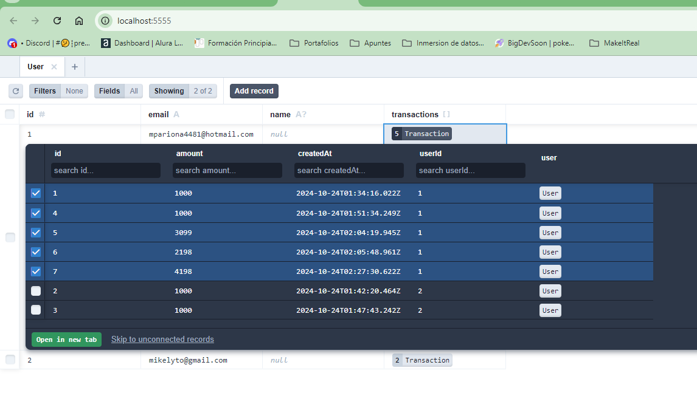

# Proyecto de Tienda en Línea - Backend

Este es el backend de una tienda en línea que gestiona las operaciones de pago y almacena información de productos utilizando Prisma y Aiven.

## Tabla de Contenidos

- [Resumen](#resumen)
- [El desafío](#el-desafío)
- [Pantallazo](#pantallazo)
- [Mi proceso](#mi-proceso)
- [Tecnología utilizada](#tecnología-utilizada)
- [Lo que aprendí](#lo-que-aprendí)
- [Desarrollo a futuro](#desarrollo-a-futuro)
- [Recursos útiles](#recursos-útiles)
- [Autor](#autor)
- [Agradecimientos](#agradecimientos)

## Resumen

### El desafío

Los usuarios deben ser capaces de:

- Realizar pagos seguros a través de la API de Stripe.
- Almacenar y gestionar productos en la base de datos utilizando Prisma.
- Manejar las solicitudes y respuestas a través de rutas RESTful.

### Pantallazo

Quiero mostrar el prisma como interfaz que conecta al postgress de mi ruta .env:
Aqui la columna "amount" esta en valores de miles, se divide entre 100 y se tiene el valor en precio dolar,


## Mi proceso

Implementé un servidor Express que se comunica con Stripe y Prisma. La configuración de CORS se utilizó para permitir solicitudes desde el frontend.

### Tecnología utilizada

- Node.js y Express para el servidor
- Prisma como ORM para la base de datos
- Stripe para el procesamiento de pagos
- Helmet y CORS para la seguridad

### Lo que aprendí

Aprendí a configurar un backend robusto que interactúa con Stripe y Prisma. A continuación, un fragmento de código que muestra cómo se manejan las solicitudes de pago:

```javascript
app.post("/api/checkouts", async (req, res) => {
  const { amount, paymentMethod } = req.body;
  // Lógica para procesar el pago con Stripe
});
```

### Desarrollo a futuro

Planeo implementar más funciones en el backend, como la autenticación de usuarios y la gestión de órdenes. También quiero explorar cómo hacer que la API sea más eficiente y escalable.

### Recursos útiles

Documentación de Prisma
Stripe API Reference

## Autor

- Github - [@Mikelyto1994](https://github.com/Mikelyto1994)

## Agradecimientos

Agradezco a los instructores del curso Make It Real por proporcionar un marco tan útil para este proyecto. Me basé en el ejercicio ya avanzado por el profesor khriztianmoreno
